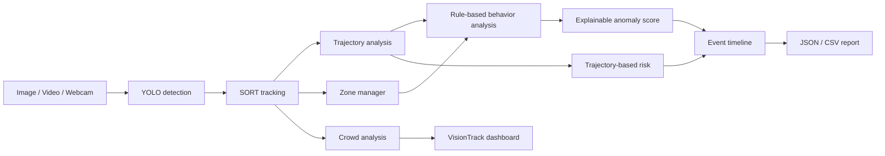

# VisionTrack AI: Video Intelligence & Behavior Analysis

VisionTrack AI is not merely an object detector. It combines YOLO and class-aware SORT tracking with explainable, rule-based trajectory, behavior, anomaly, risk, zone, crowd, event-timeline, and reporting analytics.

The system does not claim learned activity recognition or fabricated accuracy. Every alert is derived from configurable rules and includes its reason.

## Problem statement

Object detection identifies what is visible in one frame. Video intelligence adds the context needed to understand how an object moved, whether it entered a restricted area, and why an alert was raised.

## Key features

- YOLO object detection with class names and boxes
- Class-aware SORT IDs with configurable association settings
- Centroid history, trajectory paths, direction arrows, and pixel-per-second speed estimates
- Rule-based normal movement, stopped-object, loitering, sudden-direction, acceleration, and deceleration behaviors
- Explainable anomaly scores from 0–1 with LOW/MEDIUM/HIGH statuses
- Clearly labelled trajectory-based restricted-zone risk predictions
- User-defined normal, restricted, entry, and exit zones
- Line-crossing and zone entry/exit events
- People count, density, dominant movement direction, and growth signals
- Filterable event timeline, annotated MP4, JSON report, and CSV timeline export
- Streamlit dashboard plus CLI, image, video, camera-photo, and local-webcam inputs

## Architecture



## Project layout

```text
.
├── streamlit_app.py                    # Dashboard
├── main.py                             # Existing CLI entry point
├── src/object_detection/
│   ├── app.py                          # Existing OpenCV/YOLO CLI pipeline
│   ├── tracker.py                      # SORT tracker
│   └── intelligence/
│       ├── trajectory.py               # History, speed, direction
│       ├── zones.py                    # Zone transitions
│       ├── behavior.py                 # Explainable behavior rules
│       ├── anomaly.py                  # Anomaly scoring
│       ├── crowd.py                    # Crowd analytics
│       ├── events.py                   # Event timeline
│       ├── engine.py                   # Per-frame orchestration
│       └── reports.py                  # JSON and CSV exports
└── tests/                              # Unit tests
```

## Installation

Requires Python 3.9 or newer.

```powershell
git clone https://github.com/THANGASAMY-SINGARAM/Object-Detection.git
cd Object-Detection
python -m venv .venv
.\.venv\Scripts\Activate.ps1
python -m pip install --upgrade pip
python -m pip install -r requirements.txt
```

## Streamlit dashboard

```powershell
streamlit run streamlit_app.py
```

Open `http://localhost:8501` (or the URL shown in the terminal). Choose image, video, webcam photo, or local webcam; set confidence/IoU/tracker settings; define up to three zones; then process a video to download the annotated output and intelligence reports.

The local-webcam mode accesses the camera on the computer hosting Streamlit and is frame-limited to keep the UI responsive.

## CLI

```powershell
# Webcam
python main.py --source 0

# Save an annotated video
python main.py --source .\input.mp4 --save .\outputs\tracked.mp4

# Headless/batch mode
python main.py --source .\input.mp4 --save .\outputs\tracked.mp4 --no-display
```

## Configuration

| Control | Purpose |
| --- | --- |
| Confidence threshold | Minimum accepted YOLO detection confidence. |
| Tracking IoU | Required overlap to associate a detection with an existing track. |
| Track age / confirmation | Unmatched-track retention and matches required to confirm it. |
| Trajectory history | Number of centroids preserved and drawn per ID. |
| Intelligence zones | Normal, restricted, entry, and exit rectangles. |
| Flow counting | Enables the line-crossing counter. |

### Dense-scene detection controls

The dashboard provides Fast, Balanced, Accuracy, and Custom detection modes. They select a real model/resolution pair: Fast (`YOLOv8n`, 640), Balanced (`YOLOv8s`, 960), and Accuracy (`YOLOv8m`, 1280). You can also set YOLO confidence, YOLO NMS IoU, maximum detections, conservative image enhancement, and optional tiled still-image inference. Higher resolution, stronger models, and tiling can improve recall for small or overlapping traffic objects, but reduce FPS.

Detection statistics are computed before SORT tracking, so tracking IDs cannot conceal a detection issue. Quantitative accuracy (precision, recall, F1, mAP) cannot be calculated without a labelled ground-truth dataset. For a custom traffic model, annotate images in YOLO format, split train/validation/test, train with Ultralytics, then compare validation metrics against the pretrained model before claiming improvement.

## Example output

```json
{
  "unique_objects": 12,
  "average_speed_px_s": 43.5,
  "most_active_zone": "Zone A",
  "highest_risk_event": {
    "track_id": 4,
    "risk_score": 0.72,
    "reason": "Trajectory-based prediction: object is moving toward restricted zone Zone A."
  }
}
```

## Performance and limitations

The app displays processing FPS, average inference latency, active tracks, and crowd density. Results depend on model size, resolution, and hardware; no fixed performance or accuracy figure is claimed.

Speeds are pixel-space estimates until camera calibration is added. Behavior, anomaly, and risk features are deterministic configurable rules, not trained activity-recognition models. SORT may change IDs after severe occlusion, and zone/risk estimates rely on 2D image coordinates.

## Future improvements

- Calibrated real-world speed/distance
- Polygon zones and saved zone profiles
- Learned activity/anomaly models trained on labelled data
- Multi-camera identity association
- PDF report export

## Tests

```powershell
python -m unittest discover -s tests -v
```

Tests cover tracker association plus trajectory, direction, speed, zone transitions, behavior, anomaly, and event logging.

## License

[MIT License](LICENSE)
